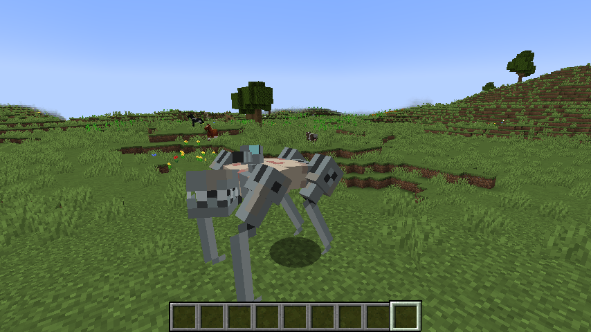

# Experiment 532 model for Figura

Play Minecraft as a terrible ex-human, a beast of flesh and steel...

This is model for the [Figura](https://github.com/FiguraMC/Figura) mod.
This model requires at least default permission level!

## Requirements

You'll need to download the following Lua scripts into this folder:

* https://github.com/JimmyHelp/JimmyAnims
* https://github.com/GrandpaScout/GSAnimBlend

## Known Issues

* Some modded item holding animations will inevitably be wonky. I can't possibly cover them all.
* Spears are a bit fidgety when you try to throw them. Might be a problem with Jimmy's?
* The first-person view is wrong. Figura doesn't make first-person support very easy.
* Left-handed mode is not supported.
